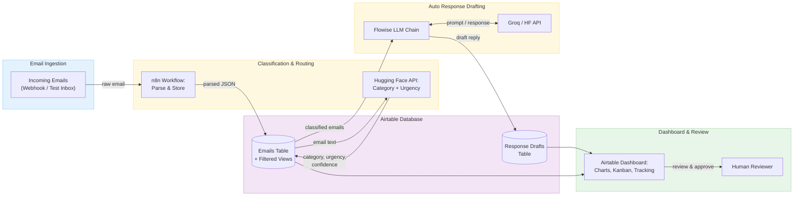

# Email Triage & Auto-Responder

An AI-powered email assistant that automatically classifies incoming emails by category and urgency, drafts responses for common request types, and routes important messages to the right queue for human review.

## Team

| Name | Component | GitHub |
|------|-----------|--------|
| Rimsha Tahir | Email Ingestion + Classification & Routing | [@rimshatahir](https://github.com/rimshatahir) |
| Sabina Ruzieva | Auto Response Drafting | [@sabinova](https://github.com/sabinova) |
| Zainab Chaudhry | Integration, Testing & Dashboard | [@zainabc22](https://github.com/zainabc22) |

## Problem

Email overload is a universal workplace challenge. Important messages get buried, routine requests go unanswered for hours, and manual sorting wastes valuable time. This system automates email triage by classifying messages, generating draft replies, and presenting everything through a clear dashboard — freeing humans to focus on what truly needs their attention.

## Architecture



## How It Works

1. **Email Ingestion** — An n8n workflow captures incoming emails via webhook or test inbox polling, parses the sender, subject, body, and timestamp, and stores the data in Airtable.
2. **Classification & Routing** — The same workflow sends each email to the Hugging Face API for category classification (question, complaint, request, informational, spam) and urgency assignment (low, medium, high), then updates the Airtable record and routes it to the appropriate queue view.
3. **Auto Response Drafting** — A Flowise LLM chain generates draft replies for common email categories. Drafts are stored in a review queue in Airtable so a human can approve, edit, or reject them before sending.
4. **Dashboard & Review** — Airtable dashboard views show category distribution, urgency breakdown, auto-response acceptance tracking, and a Kanban board for messages needing human attention.

## Tech Stack

| Tool | Purpose |
|------|---------|
| n8n | Workflow automation (ingestion, classification, routing) |
| Airtable | Database, filtered views, dashboard, and review queues |
| Hugging Face API | Email classification and urgency detection |
| Flowise | LLM chain for generating draft responses |
| Groq API | Text generation backend for Flowise |
| draw.io | Architecture diagram |
| GitHub | Version control, documentation, and collaboration |

## Repository Structure

```
ai-capstone-email-triage/
├── README.md
├── docs/
│   ├── proposal.md
│   ├── architecture.png
│   └── architecture.drawio
├── component-1-ingestion-classification/
│   └── README.md
├── component-2-auto-response/
│   └── README.md
├── component-3-integration-testing/
│   └── README.md
└── data/
    └── README.md
```

## Documentation

- [Project Proposal](docs/proposal.md) — Full project plan with component breakdown, success criteria, and timeline
- [Architecture Diagram](docs/architecture.png) — Visual system architecture

## Status

| Milestone | Status |
|-----------|--------|
| Project proposal and architecture diagram | ✅ Complete |
| GitHub repo setup and structure | ✅ Complete |
| Component development (Weeks 4–9) | ⬜ Upcoming |
| Integration and dashboard (Weeks 10–12) | ⬜ Upcoming |
| Final documentation and demo (Weeks 13–15) | ⬜ Upcoming |